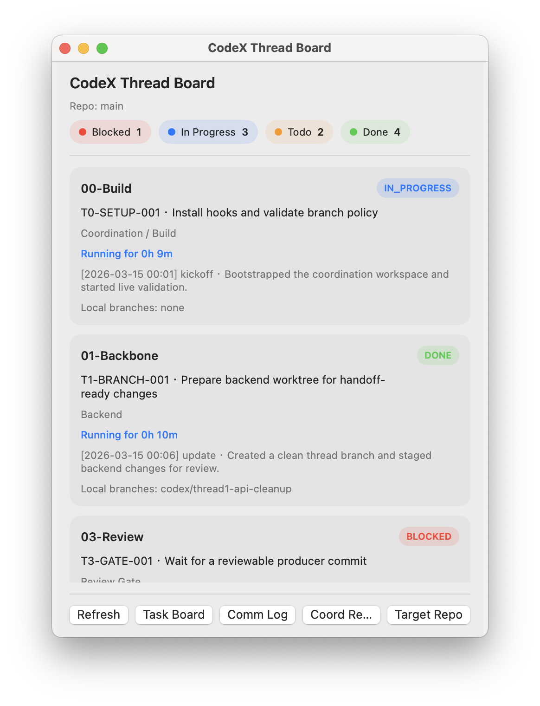

# Codex Coordination Kit

[中文说明](README.zh-CN.md)

Codex Coordination Kit turns a plain git repo into a multi-thread Codex workflow with:

- an isolated coordination control plane repo
- task board, comm log, and handoff records
- branch and worktree policy enforcement
- hook-driven auto branch creation on task claim
- hook-driven Codex review gates on thread branch commits
- machine-readable status export for dashboards or bots

The project is a reusable, open-source rewrite of a live private coordination workspace. Hard-coded repo paths were removed and replaced with a local gitignored config file plus bootstrap scripts.

It also installs repository-local Codex guidance into the target repo via:

- `AGENTS.md`
- `.codex/AGENTS.md`
- `.agent/coordination.json`

Those files are used to keep Codex threads and automated review aligned with repo-specific ownership, guardrails, and privacy rules.

## Preview

Actual macOS StatusBoard preview window, captured with sanitized sample data:



## What Lives Here

- `THREADS.json`: active Codex thread registry
- `TASK_BOARD.md`: work queue with ownership and status
- `COMM_LOG.md`: kickoff, blocker, and update log
- `HANDOFFS.md`: formal review and merge handoffs
- `thread_branch_flow.sh`: start, audit, and finish branch/worktree flow, with optional task/log updates
- `register_project.sh`: one-step registration for an existing project, including bootstrap, hook install, and doctor
- `doctor.sh`: validates config, git wiring, status export, and optional hook installation health
- `install_hooks.sh`: installs coordination hooks into both repos
- `scripts/doctor.py`: validates that the kit is wired correctly against the target repo
- `scripts/self_test.py`: runs an end-to-end smoke test in temporary repos
- `scripts/auto_branch_claim.py`: creates worktrees when `IN_PROGRESS` tasks are claimed
- `scripts/auto_review_gate.py`: runs `codex exec` reviews against thread branches
- `scripts/coord_task_event.py`: updates `TASK_BOARD.md` and `COMM_LOG.md` together for start/finish/block/retry events
- `scripts/coord_commit_guard.py`: blocks target-repo commits when the thread has no `IN_PROGRESS` task or kickoff log
- `scripts/export_status.py`: emits JSON for dashboards or custom boards
- `tools/StatusBoard/`: macOS menu bar app for a native status board
- `rewrite_requests/`: gitignored rewrite recall artifacts emitted after blocked reviews

## Repo Model

This repo is the control plane. Your product repo stays separate.

The control plane keeps governance, logs, and automation. The product repo keeps tracked application code. Thread work happens in worktrees created from the target repo base branch.

## Default Demo

The tracked template now ships with a compact 5-thread demo so the kit can coordinate on itself out of the box:

- `thread0` / `00-Product`: product manager and coordination owner
- `thread1` / `01-Backend`: Python automation, hooks, and review backend
- `thread2` / `02-Board`: native StatusBoard frontend
- `thread3` / `03-Review`: review gate
- `thread4` / `04-Readme`: README and docs

You can keep this as a working demo or replace it by editing `THREADS.json`, `TASK_BOARD.md`, `OWNERSHIP.md`, and `THREAD_BRIEFS.md`.

The default demo now mixes two branch modes:

- `thread1` uses the persistent backend branch `codex/thread1-mainline`
- other producer threads use scoped branches like `codex/thread2-board-polish`

Persistent branches are configured through `persistent_branches` in `coordination.config.json`. Running `thread_branch_flow.sh start` on a persistent thread reuses that branch and syncs it with the latest base branch before work starts. Scoped threads still open a fresh `codex/threadX-<scope>` branch per task.

If you register this repo against itself for the built-in demo, `finish` tolerates dirty coordination runtime files such as `TASK_BOARD.md`, `COMM_LOG.md`, `HANDOFFS.md`, `reviews/`, `rewrite_requests/`, and `runtime/`, so live review/task updates do not block merge-back.

## Quick Start

1. Clone this repo where you want the control plane to live.
2. Register your existing target repo in one step.
3. Regenerate starter prompts if you change `THREADS.json`.

```bash
cd /path/to/codex-coordination-kit
./register_project.sh --target-repo /path/to/target-repo
python3 scripts/generate_starter_prompts.py
python3 scripts/export_status.py
```

`register_project.sh` wraps bootstrap, installs hooks into both repos, and runs a doctor check. Bootstrap still exists if you want more manual control:

```bash
./bootstrap.sh --target-repo /path/to/target-repo --install-hooks --doctor
```

Bootstrap writes `coordination.config.json`, which is gitignored so local paths stay out of the public repo. If the target repo only has `origin/main` or `origin/master`, bootstrap will create the matching local tracking branch automatically so branch/worktree flow works immediately.

Bootstrap also installs repo-level instruction files into the target repo:

- `AGENTS.md`
- `.codex/AGENTS.md`
- `.agent/coordination.json`

If those files already exist and are not managed by this kit, bootstrap preserves them instead of overwriting them.

The tracked demo template enables `thread1 -> codex/thread1-mainline` as a persistent branch by default. You can edit or remove that mapping in local config.

If registration updates the target repo `.gitignore`, commit that change on the target repo base branch before your first merge-back.

Start the native macOS board:

```bash
tools/StatusBoard/run.sh
```

Open the board in a normal preview window instead of the menu bar extra:

```bash
tools/StatusBoard/run.sh --preview-window
```

Run the board against the bundled sanitized sample snapshot:

```bash
CODEX_COORDINATION_SNAPSHOT_FILE=tools/StatusBoard/SampleData/sample_status.json \
tools/StatusBoard/run.sh --preview-window
```

The board shows the duration of the last completed thread run, measured from the latest `kickoff` log to the latest follow-up log for that same run. Thread registration and collaboration guidance open in detached windows, so you do not lose the form when the menubar popover closes.

## Standard Workflow

1. Claim a task in `TASK_BOARD.md` and move it to `IN_PROGRESS`.
2. Let the coordination repo hook auto-create a compliant branch, or create one manually.

Scoped producer thread example:

```bash
bash thread_branch_flow.sh start --thread thread2 --scope board-polish --task T2-BOARD-001 --note "kickoff note"
```

Persistent backend thread example:

```bash
bash thread_branch_flow.sh start --thread thread1 --task T1-BACKEND-001 --note "kickoff note"
```

3. Work only inside the generated target-repo worktree.
4. Commit on the thread branch.
5. Let the target repo hook trigger an automated Codex review.
6. If the review handoff includes `ALLOW_MERGE_TO_BASE`, merge manually or enable `auto_finish_on_approve` in local config.

Audit current branches:

```bash
bash thread_branch_flow.sh audit
```

Merge after an approved handoff:

```bash
bash thread_branch_flow.sh finish \
  --branch codex/thread2-board-polish \
  --review-ref H-T3-THREAD2-AUTO-20260314123456 \
  --task T2-BOARD-001 \
  --note "merged after thread3 allow" \
```

If you want a single command to claim or finish work without editing markdown manually, use:

```bash
python3 scripts/coord_task_event.py start --thread thread2 --task T2-BOARD-001 --note "kickoff note"
python3 scripts/coord_task_event.py finish --thread thread2 --task T2-BOARD-001 --note "completion note"
```

## Hook Behavior

`install_hooks.sh` installs coordination hooks in both repos:

- coordination repo `post-commit`: scans `TASK_BOARD.md` for `IN_PROGRESS` rows and auto-creates thread worktrees for threads with `auto_branch: true`
- persistent branches are preserved after merge-back and synced to the updated base branch; scoped branches are deleted when `finish --cleanup-source` runs
- target repo `pre-commit`: blocks producer commits until the branch has a matching `IN_PROGRESS` task and kickoff log
- target repo `post-commit`: launches `codex exec --output-schema` asynchronously against the current thread branch and writes the gate result into `reviews/`, `HANDOFFS.md`, and `COMM_LOG.md`
- target repo `pre-push`: re-triggers the same asynchronous review flow as a safety net before push
- if a review returns `BLOCK_MERGE_TO_BASE`, the kit emits a rewrite request under `rewrite_requests/` and can optionally re-invoke the applicant thread with `codex exec`
- the review hook keeps a per-branch lock under `runtime/` so repeated commits do not launch overlapping reviews, and it will automatically chase the newest commit on the same branch if a newer commit lands while review is still running

If an existing hook file is already present for the same hook name, the installer moves it to `<hook>.pre-codex-coordination` and chains to it.

## Health Check

Run a full readiness check at any time:

```bash
./doctor.sh --require-hooks
```

This validates:

- required coordination files
- local config and target git repo wiring
- base branch availability
- repo-level Codex agent config presence
- `codex` executable presence
- status export health
- installed hook files when `--require-hooks` is used

For a lightweight regression smoke test of the full registration flow, use:

```bash
python3 scripts/self_test.py
```

The smoke test covers both the normal split control-plane/target-repo setup and the self-registering demo setup where this repo acts as both control plane and target repo.

## Does This Require A Codex Login

The kit itself does not bundle credentials and does not log in for you.

- If `codex exec` already works on the machine where hooks run, no extra login step is needed for this repo.
- If that machine is not authenticated yet, the automated review hook will not be able to run Codex reviews until the local Codex CLI is logged in.
- `coordination.config.json` is gitignored and should contain only local paths and runtime options, never tokens.

## Privacy

- The repo tracks no local machine paths by default.
- Bootstrap writes machine-specific settings into the ignored `coordination.config.json`.
- The preview image comes from the real SwiftUI StatusBoard app and uses sanitized sample data only.
- Avoid publishing personal git author metadata when open-sourcing your own fork. Using a generic bot identity or a GitHub noreply address is safer than a personal email.

## Configuration

Tracked file: `coordination.config.example.json`

Local runtime file: `coordination.config.json`

Fields:

- `target_repo`: absolute path to the product repo
- `base_branch`: branch used as the merge base, usually `main` or `master`
- `worktree_root`: absolute path for generated worktrees
- `codex_command`: command prefix used to invoke Codex, for example `["codex"]`
- `codex_exec_args`: extra args added before the review prompt, for example a model flag
- `auto_finish_on_approve`: whether an approved review should immediately run `finish`
- `auto_rewrite_on_block`: whether a blocked review should automatically re-invoke the applicant thread on the current worktree
- `max_auto_rewrite_attempts`: loop guard for auto rewrite retries on the same branch
- `review_timeout_seconds`: timeout for a single automated review invocation before the hook logs a blocker and exits
- `persistent_branches`: optional map of `thread_id -> branch_name` for threads that should reuse one branch, for example `thread1 -> codex/thread1-mainline`

Bootstrap flags:

- `--install-hooks`: install hooks as part of bootstrap
- `--doctor`: run a post-bootstrap health check
- `--codex-exec-arg`: append an extra `codex exec` argument; repeat as needed
- `--persistent-branch`: pin a thread to a reusable branch using `THREAD_ID=BRANCH`; repeat as needed
- `--auto-rewrite-on-block`: enable automatic rewrite recall on blocked review
- `--max-auto-rewrite-attempts`: cap automatic rewrite retries
- `--review-timeout-seconds`: configure automated review timeout

## Git Notes

- Keep this repo separate from the target repo when possible.
- If `worktree_root` is inside the target repo, bootstrap will add it to the target repo `.gitignore`.
- If the control plane repo itself is nested under the target repo, bootstrap will also add the coordination folder to the target repo `.gitignore`.
- This repo does not assume `master`; the base branch is configurable.

## Publishing

The repo is ready to be published as a public template or a normal public repo. Only generic defaults are tracked. All machine-specific paths stay in the ignored local config file.
